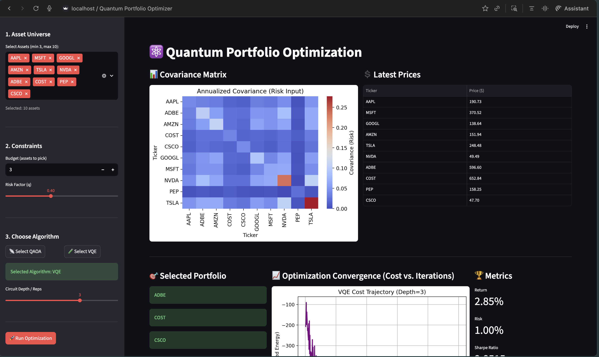
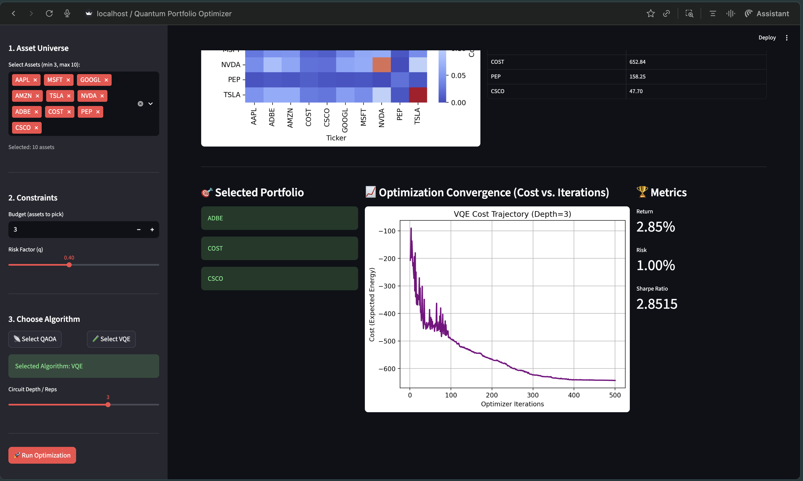

## Quantum Portfolio Optimization: A Variational Approach

<br>

**Author:** Shyam's Project
 <br> **Repository:** https://github.com/shyam-003/Quantum-Portfolio-Optimization.git

---

<br>

### 1. Introduction

This project demonstrates the use of Quantum Computing algorithms, specifically the Variational Quantum Eigensolver (VQE) and the Quantum Approximate Optimization Algorithm (QAOA), to address the classic financial problem of Portfolio Optimization. This task is a typical NP-hard problem, challenging for classical computers at scale due to the combinatorial explosion of asset selection choices. The goal is to find the optimal subset of assets that maximizes the Sharpe Ratio (return-to-risk ratio) under defined budget and risk constraints.

The application is provided as an interactive dashboard using Streamlit, allowing users to define constraints and compare the performance characteristics of the two quantum algorithms.

---

<br>

### 2. Key Features

- **Quantum Solution:** Maps the mean–variance portfolio problem into a **QUBO (Quadratic Unconstrained Binary Optimization)** model, which is suitable for quantum heuristic solvers.
- **Algorithm Comparison:** Implements and compares **VQE** and **QAOA** using the Qiskit quantum computing framework.
- **Real-Time Data:** Fetches historical stock data (returns and covariance) for selected assets via the `yfinance` library.
- **Interactive Dashboard:** Streamlit interface for setting inputs, running the optimization, and visualizing results in real time.
- **Visualization:** Displays the covariance matrix, optimization convergence trajectory (cost vs. iterations), selected portfolio assets, and final performance metrics.

---

<br>

### 3. Technical Stack

The project is built using a hybrid quantum–classical stack:

- **Programming Language:** Python 3.11+
- **Quantum Framework:** Qiskit
- **Web Framework:** Streamlit
- **Financial Data:** `yfinance`
- **Classical Optimizer:** COBYLA

---

<br>

### 4. Getting Started

#### 4.1 Installation

The following steps assume a virtual environment is set up and activated.

 1. Clone the repository
    ```
    git clone https://github.com/shyam-003/Quantum-Portfolio-Optimization.git
    cd Quantum-Portfolio-Optimization
    ```

 2. Install dependencies
    ```
    pip install -r requirements.txt
    ```


### 4.2 Running the Application

Execute the Streamlit dashboard using the following command:
```
streamlit run app.py
```

The application will launch in your default web browser (usually at `http://localhost:8501`).

---

<br>

### 5. Dashboard Overview and Inputs

The Streamlit dashboard is structured into three main areas: **Inputs (Sidebar)**, **Visualization (Main Area)**, and **Metrics**.

#### **5.1 Inputs (Sidebar)**

1. **Asset Universe:** Select the tickers (up to 10 for current quantum simulation limits).
2. **Constraints:** Set the maximum number of assets to pick (budget) and the risk factor $( \gamma )$ for the objective function.
3. **Choose Algorithm:** Select either VQE or QAOA and adjust the circuit depth/repetitions $(p)$.

#### **5.2 Visualization (Main Area)**

The main panel updates dynamically after optimization:

- **Covariance Matrix:** A heatmap showing the annualized correlation and risk input between assets.
- **Selected Portfolio:** Displays the final, optimized subset of assets (binary output of the quantum solution).
- **Optimization Convergence:** A plot tracking the cost (energy) of the best solution found over the course of the classical optimization iterations.

---

<br>

### 6. Example Results

Below are illustrative placeholders describing the visual output of the dashboard interface and the visualization of metrics and convergence plots using the VQE algorithm.

#### 6.1 Dashboard View 1: Initial Run & Covariance



> *Initial run showing asset selection and covariance matrix input.*

#### 6.2 Dashboard View 2: Final Results & Convergence Trajectory



> *Final results showing selected portfolio, convergence plot, and metrics.*

---

---

<br>

### 🌟 7. Contributions and Impact

This project provides a robust, end-to-end framework for investigating Quantum Portfolio Optimization on current hardware, making several valuable contributions:

- **Hybrid demonstration of QUBO formulation:** The project demonstrates the full hybrid quantum–classical pipeline for financial optimization, including the crucial step of mapping the mean–variance portfolio problem (with constraints) into a QUBO (Quadratic Unconstrained Binary Optimization) model, which is the required input for quantum solvers such as VQE and QAOA.

- **Direct algorithm benchmark:** By implementing both the Variational Quantum Eigensolver (VQE) and the Quantum Approximate Optimization Algorithm (QAOA) on the same problem instance, the project creates an immediate and accessible benchmark. This lets users empirically compare convergence speed, solution quality, and sensitivity to circuit depth \(p\) between two leading NISQ-era optimization algorithms.

- **Interactive and reproducible research:** The Streamlit dashboard offers an intuitive, real-time interface that makes the project highly accessible and reproducible, moving the quantum–classical workflow out of static notebooks into a user-friendly application that non-experts can interact with.

- **Practical financial integration:** The incorporation of real-time stock data via `yfinance` ensures that optimization is carried out on realistic, dynamic market inputs (expected returns and covariance), giving practical relevance to the theoretical quantum approach.

---

<br>

### 🚀 8. Future Work and Enhancements

The current project is a strong foundation that can be expanded in several exciting directions as quantum hardware and software mature.

#### 8.1 Algorithmic and Quantum Hardware Enhancements

- **Execution on real quantum hardware:** At present, the project uses a `Sampler()` that typically runs on a noiseless simulator. A key next step is to execute the optimization on real NISQ devices (for example, via IBM Quantum), to study how decoherence and gate errors affect VQE/QAOA performance.

- **Advanced cost aggregation (CVaR):** The current objective minimizes the expectation value $\langle H \rangle$. A significant enhancement is to implement a **Conditional Value-at-Risk (CVaR) objective**, which focuses on tail losses and can yield more risk-averse, practically relevant portfolios.

- **Quantum error mitigation:** Incorporate and compare error mitigation techniques such as zero-noise extrapolation and measurement error mitigation to improve solution quality and extend the usefulness of small-scale experiments on real hardware.

- **Warm-starting VQE/QAOA:** Explore warm-start strategies where a classically obtained or heuristic portfolio is used to initialize variational parameters, potentially accelerating convergence and helping avoid barren plateaus.

#### 8.2 Financial and Modeling Enhancements

- **Scaling and asset expansion:** The current implementation targets small asset universes (e.g., up to 10 assets) due to qubit limits. Future work includes exploring problem decomposition or quantum-inspired algorithms to handle portfolios with hundreds of assets, matching institutional finance scales.

- **Higher-order constraints and moments:** Extend the QUBO formulation toward higher-order unconstrained binary optimization (HUBO) to encode non-quadratic constraints (transaction costs, sector limits) and higher-order risk moments such as skewness and kurtosis, capturing the non-Gaussian nature of real returns.

- **Multi-period optimization:** Generalize from a static, single-period optimization to multi-period portfolio optimization, requiring more complex Hamiltonians that model rebalancing decisions and compounded returns over time.

#### 8.3 Performance and Scalability

- **Efficient batching of expectation evaluations:** Implement batching strategies for evaluating expectation values, reducing overhead when training variational circuits with many iterations.
- **Parallel classical optimization:** Leverage multi-core or distributed backends to parallelize classical optimization steps, especially when exploring multiple hyperparameter settings or initializations.
- **Evaluation on real quantum hardware:** Systematically benchmark the workflow on real IBM Quantum backends to quantify the impact of noise and hardware constraints on portfolio quality.
- **Larger portfolios via decomposition:** Investigate problem-decomposition and embedding techniques to extend the approach to larger universes while staying within available qubit budgets.

#### 8.4 Dashboard Enhancements

- **Persistent configurations:** Add the ability to save and load user configurations (selected tickers, budget, risk factor, algorithm choice) for reproducible experiments.
- **Real-time market updates:** Integrate live price feeds so that the optimization can be re-run as market conditions evolve.
- **Classical vs. quantum comparison views:** Provide side-by-side charts comparing classical solvers and quantum solvers in terms of cost, Sharpe ratio, and runtime.
- **Exportable reports:** Allow users to export results (selected portfolio, metrics, plots) as PDF or CSV for downstream analysis.
- **Guided “Quantum Optimization Walkthrough”:** Add an educational mode that walks users step by step through QUBO construction, circuit setup, and optimization results.

#### 8.5 Research Opportunities

- **Depth vs. performance analysis:** Study how circuit depth \(p\) correlates with financial performance metrics (return, risk, Sharpe ratio) across different market regimes.
- **Ansatz architecture exploration:** Compare different ansatz structures (problem-inspired, hardware-efficient, layer-varying QAOA) to understand expressivity vs. trainability trade-offs.
- **Robustness under market shifts:** Test how quantum-optimized portfolios perform under simulated regime changes or volatility shocks, assessing out-of-sample robustness.
- **Benchmarking against classical heuristics:** Systematically benchmark VQE/QAOA solutions against classical metaheuristics such as genetic algorithms, particle swarm optimization, and simulated annealing.

---

<br>

### 9. Summary of Future Directions

In summary, future work spans five main axes:  
(1) **Algorithmic improvements** (warm-start VQE/QAOA, QAOA variants, gradient-based optimizers, quantum annealing backends),  
(2) **Portfolio model extensions** (transaction costs, sector and minimum-weight constraints, multi-objective optimization including ESG factors),  
(3) **Performance and scalability** (batching, parallelism, larger instances, real hardware benchmarking),  
(4) **Dashboard enhancements** (persistence, richer visual analytics, exports, tutorial modes), and  
(5) **Research opportunities** (depth–performance relationships, ansatz studies, robustness analysis, and classical–quantum comparisons).


---
